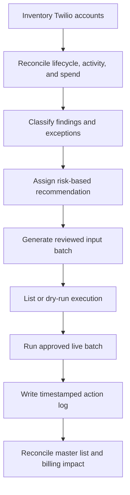

# Case: Twilio Lifecycle Cleanup & Cost Optimization

> Built and executed a Python-based Twilio lifecycle cleanup workflow that reconciled 7,900+ accounts across multiple systems, released 933 unused phone numbers, suspended 4,129 inactive accounts, and reduced recurring infrastructure costs by **US$766.55 per month (US$9,198.60 annualized)**.

---

## Context

The company maintained thousands of Twilio subaccounts created across multiple years of customer operations.

Over time, customer lifecycle changes were not always reflected consistently across Twilio, Salesforce, internal merchant settings, and product activity data. As a result, old or churned accounts could remain active, retain paid phone numbers, or continue generating infrastructure costs after they were no longer operationally required.

The Twilio invoice had reached approximately **US$9,000–10,000 per month**, but billing data alone could not determine which resources were safe to remove.

---

## Problem

The challenge was not simply finding accounts with spend.

The cleanup needed to distinguish between:

- Active customers with valid Twilio usage
- Churned customers with stale infrastructure
- Accounts with no recent product activity but legitimate operational reasons to remain
- Recently created accounts that had not generated activity yet
- Duplicate, parent, legacy, or internal accounts
- Phone numbers generating recurring costs inside accounts that should otherwise be preserved
- Conflicting records across Salesforce, Mixpanel, Twilio, and internal systems

A direct bulk deletion would have introduced significant operational risk. Some actions were reversible, while others—such as releasing phone numbers or deleting accounts—could permanently affect customer messaging infrastructure.

The project therefore required both financial analysis and a controlled execution model.

---

## Objective

Build a repeatable cleanup process that could:

1. Inventory the Twilio account environment
2. Reconcile customer status, product activity, configuration, and spend
3. Classify each account using explicit business rules
4. Select the least destructive valid action
5. Execute actions through the Twilio API in controlled batches
6. Preserve a complete audit trail
7. Measure the financial impact against the billing baseline

---

## Data Sources

The audit combined multiple systems because no single source represented the complete account lifecycle.

| Source | Role in the audit |
| --- | --- |
| Twilio account inventory | Subaccount status, identifiers, resource ownership, and API execution targets |
| Twilio billing data | Historical spend and recurring cost exposure |
| Salesforce | Customer lifecycle and commercial status |
| Mixpanel | Recent product and messaging activity |
| Merchant settings | Internal account configuration and operational flags |
| Cleanup action log | Execution result, timestamp, action, and failure details |

The reconciliation logic prioritized the **business meaning** of each source instead of assuming that a matching account name or isolated status was sufficient evidence.

For example, a Salesforce churn status could indicate that an account was no longer commercial, but recent activity still required investigation before any destructive action. Conversely, activity alone did not automatically prove that an account should remain active if internal settings and account metadata confirmed that it was a stale churned environment.

---

## Solution Design

The workflow was structured as a controlled pipeline:

### 1. Master inventory

A master list was created as the operational source of truth for approximately **7,900 Twilio accounts**.

Each row included the account identifier, supporting evidence, audit finding, recommended action, and execution status. Separate support tabs preserved the cross-reference data used to reach each decision.

### 2. Risk-based classification

Accounts were assigned to operational categories such as:

- Keep active
- Suspend
- Release paid phone numbers
- Delete account
- Manual review
- Exclude from cleanup

The action model deliberately separated:

- **Suspension**, which is generally reversible
- **Phone number release**, which removes a recurring resource and requires stronger validation
- **Account deletion**, which is the most destructive action and was reserved for narrowly defined cases

This allowed the cleanup to reduce risk and cost without treating every inactive account as an automatic deletion candidate.

### 3. Python execution tooling

Python scripts were used locally to interact directly with the Twilio API and process approved account lists.

The scripts supported operational safeguards such as:

- Explicit input files containing reviewed account identifiers
- A listing mode to confirm the intended targets
- Dry-run behavior before production changes
- A separate `--live` flag for real execution
- Controlled batch sizes
- Per-account exception handling
- Timestamped CSV outputs
- Result-level status logging
- Separation between scripts for different action types

The tooling converted a manual, account-by-account process into a repeatable operation while retaining human approval at the highest-risk decision points.

### 4. Batch control and reconciliation

Live actions were executed in defined batches instead of processing the entire inventory in one unrestricted run.

Each execution produced a new output file rather than overwriting prior evidence. Results were then reconciled back into the master list using both the Twilio account identifier and the API result—for example, confirming that a phone number was actually returned as `released`, rather than assuming success because the account appeared in an input file.

This distinction prevented attempted, failed, and completed actions from being mixed together.

---

## Auditability and Safety Controls

The project used several controls to reduce production risk:

| Control | Purpose |
| --- | --- |
| Read-only inventory and list modes | Confirm scope before making changes |
| Dry run before live execution | Validate logic and expected targets |
| Explicit `--live` execution flag | Prevent accidental production actions |
| Reviewed CSV input batches | Keep API scope limited to approved records |
| Separate action types | Avoid combining suspension, resource release, and deletion logic |
| Numbered and timestamped outputs | Preserve execution history |
| Per-record result logging | Distinguish success, failure, and partial completion |
| Master-list reconciliation | Maintain one current operational status |
| Multi-source exception review | Prevent decisions based on a single ambiguous field |
| Temporary API credentials | Limit the credential lifecycle to the project |

Credentials and customer data are intentionally excluded from the portfolio version of this project.

---

## Results

The completed actions produced measurable operational and financial impact:

| Metric | Result |
| --- | ---: |
| Twilio accounts inventoried | 7,907 |
| Accounts suspended | 4,129 |
| Accounts intentionally retained | 1,272 |
| Phone numbers released | 933 |
| Accounts deleted | 28 |
| Confirmed suspension and release actions | 5,062 |
| Accounts still pending audit | 834 |
| Quarterly billing baseline analyzed | US$27,437.05 |
| Recurring monthly savings | **US$766.55** |
| Annualized savings | **US$9,198.60** |

The cleanup reduced the recurring monthly baseline by approximately **8.4%**, with additional savings potential still available from the remaining audit queue.

The relatively small number of deletions compared with suspensions demonstrates the conservative execution strategy: the project prioritized reversible lifecycle controls and targeted removal of paid resources before permanent account deletion.

---

## Technical Stack

- **Python** for local automation, file processing, validation, and API execution
- **Twilio REST API** for account and phone-number lifecycle actions
- **CSV** for reviewed batch inputs and immutable execution outputs
- **Google Sheets** for the master inventory, classification rules, reconciliation, and summary reporting
- **Salesforce** for commercial lifecycle status
- **Mixpanel** for recent product activity
- **Twilio billing exports** for spend analysis
- **Git and GitHub** for sanitized project documentation and portfolio presentation

---

## Key Technical Decisions

### Use Python for execution, not for unreviewed decision-making

The classification logic remained visible in the master inventory, where business rules and exceptions could be reviewed. Python executed approved actions at scale but did not independently decide which customers should be removed.

### Prefer the least destructive valid action

Suspending an account, releasing a paid resource, and deleting an account have different risk profiles. Modeling them as separate operations made the process safer and easier to audit.

### Validate the result, not only the request

An account appearing in an execution batch did not prove that the action succeeded. Reconciliation used the API result recorded in the action log to update the final audit status.

### Preserve every batch as evidence

Inputs and outputs were stored separately and prior executions were not overwritten. This created a traceable relationship between reviewed targets, attempted actions, and final results.

### Treat system conflicts as investigation signals

Salesforce status, Mixpanel activity, billing spend, and internal settings could disagree. Those conflicts were routed to review rather than resolved through a simplistic source hierarchy.

---

## Outcome

The project transformed a high-cost, manually inspected Twilio environment into a governed lifecycle operation and delivered verified recurring savings.

It established:

- A consolidated inventory across fragmented systems
- Explicit and reviewable cleanup rules
- A risk-based action hierarchy
- Safe API execution through local Python tooling
- Batch-level control over production changes
- A durable record of every attempted and completed action
- **US$766.55 in recurring monthly savings**
- **US$9,198.60 in annualized savings**
- A remaining queue of 834 accounts with further optimization potential

Beyond the immediate cleanup, the workflow created a reusable operational pattern for future account lifecycle audits.

---

## What This Project Demonstrates

- Integration engineering across SaaS platforms and internal data
- Python applied to a real production operations problem
- REST API authentication and resource lifecycle management
- Financial operations and infrastructure cost optimization
- Data reconciliation across systems with conflicting semantics
- Safe automation design for destructive actions
- Batch processing, dry runs, error handling, and execution logging
- Translating ambiguous operational evidence into governed business rules
- Human-in-the-loop automation and production risk management

---

## Next Steps

- Complete the audit of the remaining 834 accounts
- Reconcile all output files against the master inventory
- Rotate or revoke the temporary API credentials
- Remove any local credential references from the project workspace
- Continue validating savings against subsequent billing cycles
- Convert the one-time audit rules into a recurring lifecycle monitoring process

---

## Repository Note

The public portfolio version documents the architecture, decision model, safeguards, and outcomes without publishing:

- API credentials
- Customer or merchant names
- Twilio account identifiers
- Phone numbers
- Raw billing exports
- Production input files
- Executable destructive-action scripts

Sanitized code samples may be added separately to demonstrate the CLI structure, dry-run controls, batch validation, and logging pattern without exposing production data or enabling direct use against the original environment.
